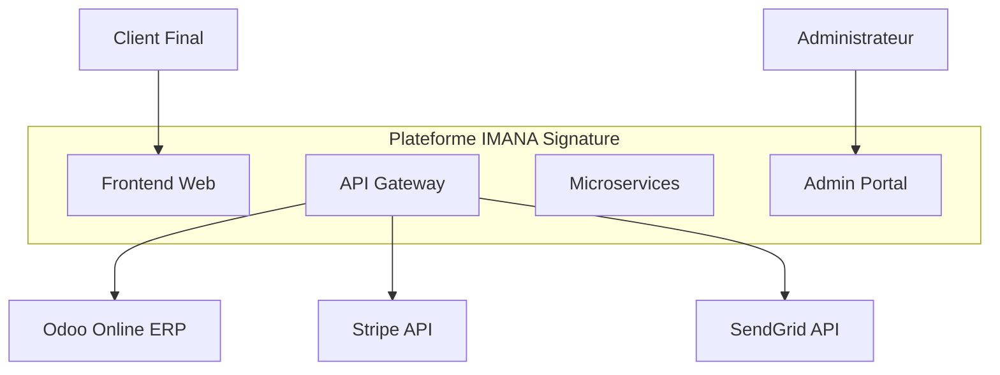
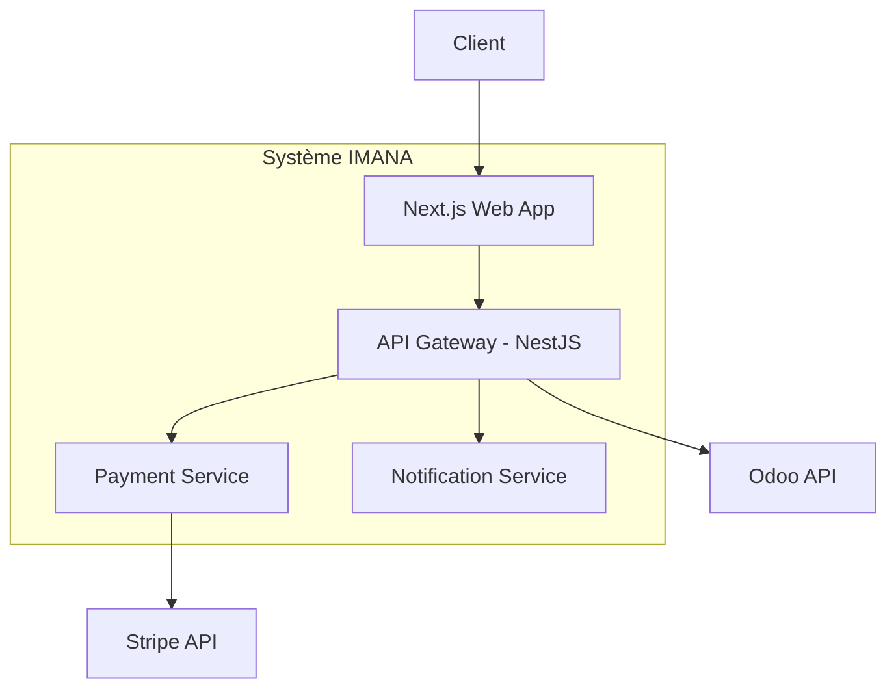

# Document d'Architecture Technique (TAD) - IMANA Signature

**Version:** 1.0
**Date:** 2024-10-26
**Auteurs:** Lead Developer, Architecte

## 1. Introduction

Ce document décrit l'architecture technique de haut niveau de la plateforme e-commerce IMANA Signature. Il a pour but de servir de référence pour toutes les équipes de développement et de s'assurer de la cohérence, de la maintenabilité et de la scalabilité du système.

## 2. Vue d'ensemble de l'Architecture

La plateforme est conçue selon une architecture **Headless** et **Microservices**, orchestrée au sein d'un **Monorepo**.

- **Monorepo (Turborepo)** : Centralise tout le code (`apps`, `services`, `packages`), simplifie la gestion des dépendances et favorise le partage de code.
- **API Gateway (NestJS)** : Point d'entrée unique pour toutes les applications clientes (BFF - Backend For Frontend). Elle agrège les données des microservices et d'Odoo, gère l'authentification et sécurise le système interne.
- **Frontend Web (Next.js)** : Application cliente principale (e-commerce) consommant l'API Gateway. Elle bénéficie du Server-Side Rendering (SSR) pour des performances et un SEO optimaux.
- **Microservices (Node.js/NestJS)** : Services indépendants et spécialisés (Paiements, Notifications, etc.) qui gèrent une logique métier spécifique.
- **ERP (Odoo Online)** : Le système maître (Source of Truth) pour toutes les données métier (produits, stocks, clients, commandes, etc.).

Pour une justification détaillée de ces choix, voir ADR-0001: Choix d'une architecture Monorepo et Microservices.

## 3. Diagrammes d'Architecture (Modèle C4)

### Niveau 1 : Diagramme de Contexte

Ce diagramme montre la plateforme IMANA Signature dans son ensemble et ses interactions avec les utilisateurs et les systèmes externes.

### Niveau 2 : Diagramme de Conteneurs

Ce diagramme zoome sur les "conteneurs" (applications, services, bases de données) qui composent la plateforme.

## 4. Flux Critiques

### Flux de Commande
1.  **Client** : Ajoute un produit au panier sur le `Frontend Web`.
2.  **Frontend Web** : Appelle `POST /api/cart` sur l'`API Gateway`.
3.  **API Gateway** : Valide le stock en temps réel via un appel à l'`API Odoo`.
4.  **Client** : Finalise la commande et procède au paiement.
5.  **Frontend Web** : Appelle `POST /api/checkout`.
6.  **API Gateway** :
    -   Appelle le `Payment Service` pour traiter le paiement via Stripe.
    -   Après succès, crée la commande (`sale.order`) dans `Odoo`.
    -   Appelle le `Notification Service` pour envoyer un email de confirmation.
7.  **Frontend Web** : Affiche la page de confirmation de commande.

---
*Ce document sera mis à jour au fur et à mesure des évolutions et des décisions prises via les ADRs.*