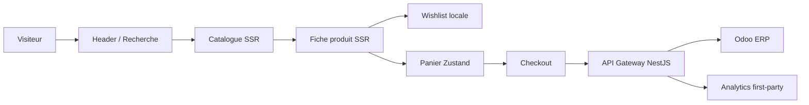

# Architecture Frontend et mapping fonctionnel

## Découpage monorepo

```text
apps/frontend-web
├── src/app                 routes, metadata, composition serveur
├── src/components          composants métier et interactions client
├── src/lib/api             accès BFF typé
├── src/lib/store           panier, checkout, wishlist persistants
└── src/styles              règles globales minimales

packages/ui-kit
└── src/index.tsx           primitives visuelles partagées

packages/shared-types
├── product.ts              contrats catalogue
├── cart.ts                 contrats panier
└── order.ts                contrats commande
```

Règles :

- Server Components par défaut ;
- `'use client'` uniquement pour état et événements ;
- aucune connexion Odoo depuis le navigateur ;
- données métier via `apps/api-gateway` ;
- règles prix, stock et promotion validées côté serveur ;
- primitives génériques dans `ui-kit`, composants métier dans l'application.

## Flux



## Wireframes

### Home

```text
+------------------------------------------------------------+
| Réassurance                                                |
| Logo | Boutique | Maison | Magazine | Conseil | ♡ | Panier |
+------------------------------------------------------------+
| IMAGE PRODUIT PLEIN ÉCRAN                                  |
| IMANA Signature                                            |
| Un parfum différent pour chaque version de vous            |
| [Explorer] [Trouver ma signature]                          |
+------------------------------------------------------------+
| Authenticité | Stock vérifié | Livraison | Conseil         |
+------------------------------------------------------------+
| Histoire / valeurs                                         |
| Univers visuels                                            |
| Produits Odoo                                              |
| Magazine / FAQ / CTA                                       |
+------------------------------------------------------------+
```

### Catalogue

```text
+----------------------+-------------------------------------+
| Recherche            | Toutes les fragrances · 24          |
| Catégorie            | [Produit] [Produit] [Produit]       |
| Disponibilité        | [Produit] [Produit] [Produit]       |
| Prix min/max         |                                     |
| Tri                  | État vide ou erreur contextualisé   |
| [Afficher]           |                                     |
+----------------------+-------------------------------------+
```

### Fiche produit

```text
+------------------------------+-----------------------------+
| Média produit 4:5            | Catégorie / Badge           |
|                              | Nom / Prix / Stock           |
|                              | Storytelling fiable          |
|                              | [Ajouter] [Wishlist]         |
|                              | Authenticité / Stock / Aide  |
+------------------------------+-----------------------------+
| Produits associés                                          |
+------------------------------------------------------------+
```

### Checkout

```text
+------------------------------------------------------------+
| 1 Coordonnées | 2 Livraison | 3 Paiement                   |
+-----------------------------------+------------------------+
| Formulaire de l'étape             | Résumé sticky          |
| [Retour] [Continuer]              | Articles / frais / total|
+-----------------------------------+------------------------+
```

## Cartographie CDC → composants

| Exigence | Route/composant | État |
|---|---|---|
| Home immersive | `/`, Hero, univers, produits | Conforme |
| Histoire/ADN/vision | `/about` | Conforme |
| Mega Menu | `Header` | Conforme MVP |
| Recherche | `Header`, `/collections` | Conforme simple |
| Catalogue avancé | `CollectionsPage`, `CatalogFilters` | Partiel données |
| Wishlist | `WishlistButton`, `/wishlist` | Conforme locale |
| Fiche premium | `ProductDetailPage` | Partiel données |
| Panier | `/cart`, `CartItemRow` | Conforme |
| Checkout | `/checkout`, composants `checkout/*` | Conforme MVP |
| Paiement sécurisé | `PaymentForm`, API commandes | Partiel fournisseur |
| Recommandations | `ProductDetailPage` | Conforme catégorie |
| Blog | `/blog`, CMS | Conforme |
| FAQ dynamique | Home + CMS | Conforme |
| Analytics | `AnalyticsTracker` | Conforme first-party |
| Compte client | aucun composant trompeur | Bloqué identité |
| Fidélité/VIP | aucun composant trompeur | Bloqué règles métier |
| Avis | non affichés | Bloqué modèle/modération |
| Promotions/coupons | non calculés côté client | Bloqué règles Odoo |

## Backlog

### Epic Identité client

- En tant que client, créer et sécuriser mon compte.
- Consulter mes commandes, adresses, factures et retours.
- Synchroniser wishlist et préférences.

Dépendance : choix Odoo Portal ou IdP, règles RGPD, récupération et MFA.

### Epic Enrichissement catalogue

- Administrer marque, famille, notes, humeur, occasion et concentration.
- Gérer une galerie et des vidéos par produit.
- Exposer les variantes et formats Odoo.
- Alimenter le sitemap dynamique et les breadcrumbs.

### Epic Conversion

- Autosuggest et recherche tolérante.
- Coupons validés par Odoo.
- Avis avec preuve d'achat et modération.
- Cross-sell piloté par Odoo.
- Webhooks Wave/Orange Money et idempotence.

### Epic Fidélité

- Points, niveaux et avantages.
- Espace VIP et campagnes segmentées.
- Carte cadeau et parrainage.

## Roadmap indicative

| Lot | Contenu | Charge | Risque |
|---|---|---:|---|
| MVP consolidé | Refonte actuelle, images Odoo, QA | 2-3 sem. | Faible |
| V1 | Identité, compte, paiements réels, coupons | 8-12 sem. | Élevé |
| V1.5 | Attributs parfum, avis, fidélité, autosuggest | 6-9 sem. | Moyen |
| V2 | Personnalisation, VIP, omnicanal, recommandation | 8-12 sem. | Élevé |

## Stratégie de tests

- unitaires : stores, filtres, mapping composants ;
- intégration : checkout, wishlist, recherche ;
- API : images produit, stock et commandes Odoo ;
- E2E : découverte → produit → panier → commande ;
- visuel : 390 × 844, 768 × 1024, 1440 × 900 ;
- accessibilité : axe + NVDA/VoiceOver ;
- performance : Lighthouse CI et Web Vitals terrain.
