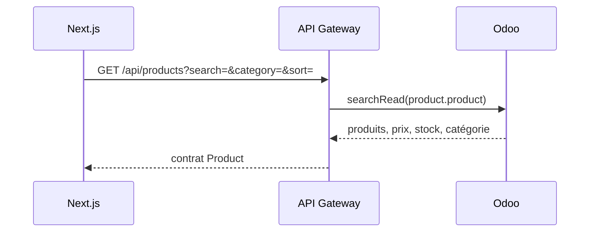
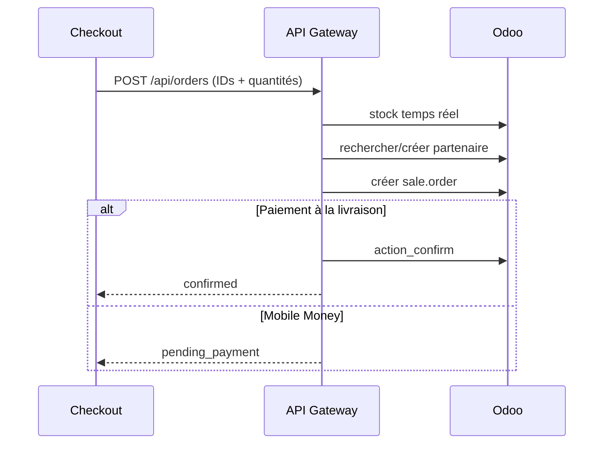

# Architecture d'intégration Odoo

## Principes

- Odoo est la source de vérité pour produits, catégories, stock, clients,
  commandes, tarifs et CRM.
- Les navigateurs ne communiquent jamais directement avec Odoo.
- L'API Gateway NestJS traduit les contrats publics en appels Odoo et masque
  identifiants techniques, erreurs internes et secrets.
- Les montants envoyés par le navigateur ne servent jamais à valoriser une
  commande.

## Flux catalogue

Le cache storefront est limité à cinq minutes. La disponibilité est toujours
revalidée au moment de commander.

## Flux commande

## Flux CRM

`POST /api/contacts` valide les données et crée un `crm.lead`. Une panne Odoo
est exposée en `503`, sans perdre la nature temporaire de l'erreur.

## Durcissement requis avant paiement en production

1. Ajouter une clé d'idempotence à `POST /orders`.
2. Créer la commande en brouillon avant le paiement.
3. Initialiser la transaction chez le fournisseur depuis le serveur.
4. Vérifier signature, montant, devise et unicité du webhook.
5. Confirmer la commande dans une transaction métier idempotente.
6. Publier un événement de confirmation et envoyer les notifications.
7. Stocker un journal d'audit sans données bancaires ni secrets.

## Décisions à prendre

- Odoo Portal ou fournisseur OIDC pour l'identité client.
- Fournisseur de paiement prioritaire et pays/devise couverts.
- Politique de réservation de stock et expiration des commandes impayées.
- Gestion des remboursements, retours et avoirs.
- SLA, retry, circuit breaker et file d'attente asynchrone.
