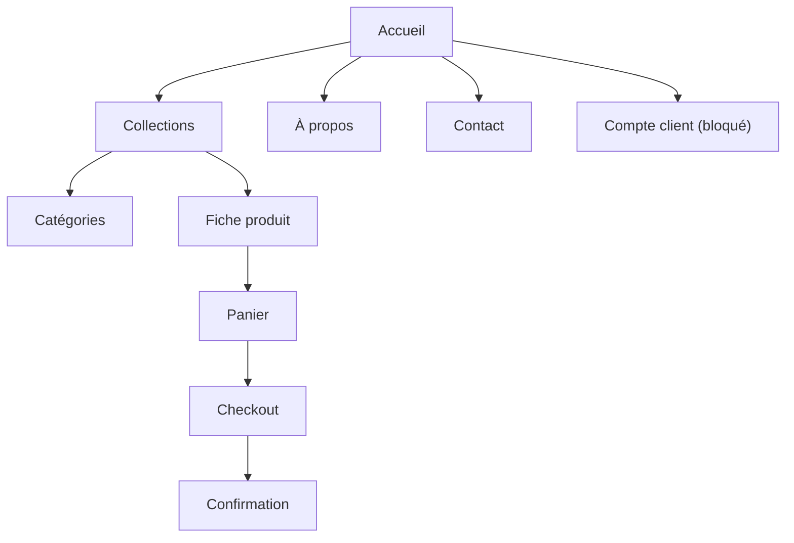

# Blueprint UX et wireframes

## Architecture de l'information



## Parcours d'achat MVP

1. Découvrir ou rechercher un produit.
2. Vérifier prix, disponibilité et description.
3. Ajouter au panier avec confirmation non bloquante.
4. Contrôler quantités et sous-total.
5. Saisir l'adresse, choisir la livraison et le paiement.
6. L'API revalide le stock et crée la commande Odoo.
7. Afficher l'identifiant et le statut de commande.

## Wireframe catalogue

```text
+--------------------------------------------------------------+
| Logo      Collections  Catégories  À propos  Contact  Panier |
+--------------------------------------------------------------+
| Nos collections                                              |
| [Recherche          ] [Catégorie v] [Tri v] [Appliquer]      |
+--------------------------------------------------------------+
| Produit       Produit       Produit       Produit             |
| image         image         image         image               |
| nom/prix      nom/prix      nom/prix      nom/prix            |
+--------------------------------------------------------------+
```

## Wireframe checkout

```text
+--------------------------------+-----------------------------+
| 1 Adresse  2 Livraison  3 Paie | Résumé commande             |
|                                | Produit x quantité           |
| Formulaire de l'étape          | Sous-total                  |
|                                | Livraison                   |
| [Continuer]                    | Total                        |
+--------------------------------+-----------------------------+
```

## États obligatoires

- Chargement sans déplacement de mise en page.
- Catalogue vide distinct d'une panne technique.
- Produit indisponible non ajoutable.
- Validation champ par champ et résumé d'erreur accessible.
- Paiement en cours non soumis deux fois.
- Échec temporaire conservant panier et données de livraison.

## Maquettes haute fidélité

Le code Next constitue le prototype interactif actuel. Une maquette Figma
validable nécessite la charte, les photographies et le CDC détaillé. Le design
system de ce dépôt doit servir de source de vérité pour cette production.
